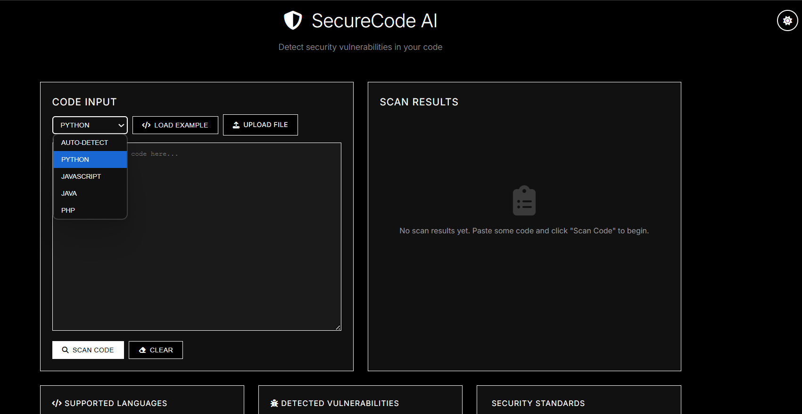
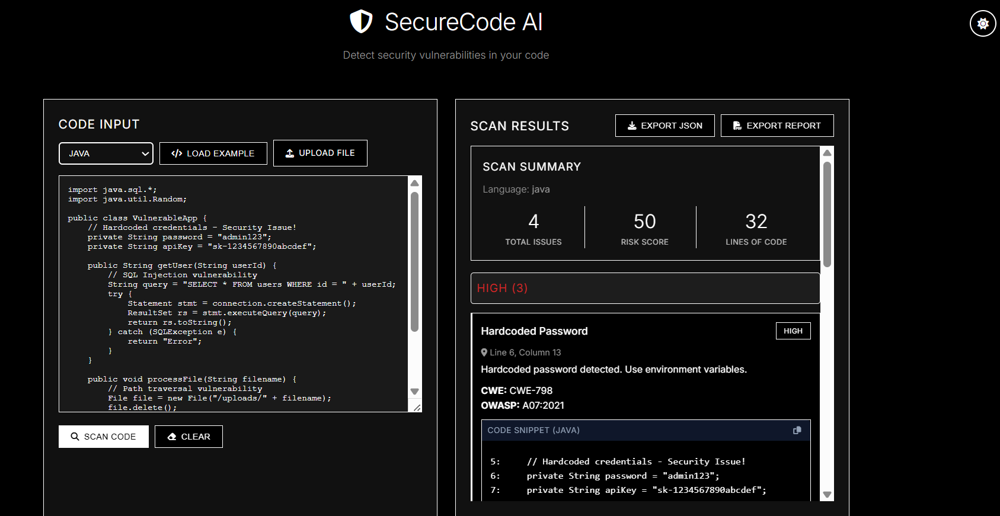
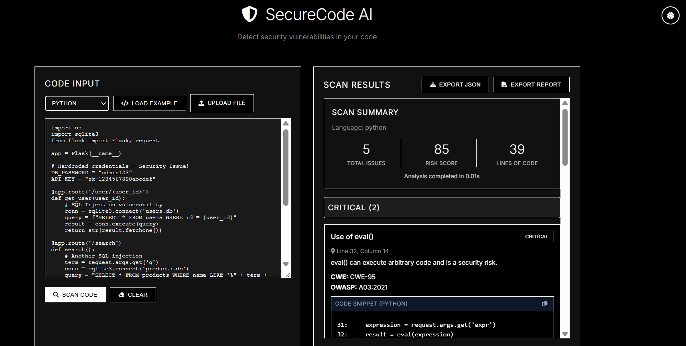

# 🛡️ SecureCode AI - Multi-Language Security Scanner

A web-based security vulnerability scanner that analyzes Python, JavaScript, Java, and PHP code in real-time.

## ✨ Features

### 🔍 Vulnerability Detection
- **10+ Security Checks**: SQL Injection, XSS, Command Injection, Path Traversal, and more
- **Multi-Language Support**: Python, JavaScript, Java, and PHP
- **Industry Standards**: OWASP Top 10 and CWE classifications
- **Real-time Analysis**: Instant security feedback

### 💻 User Experience
- **Modern Web Interface**: Clean, minimalistic black & white design
- **Dark/Light Theme**: Toggle between themes with persistent preference
- **File Upload**: Drag and drop or browse for code files
- **Export Options**: Download results as JSON or formatted text report
- **Syntax Highlighting**: Language-specific code highlighting
- **Copy Snippets**: One-click copy for code examples

### 🛡️ Security & Performance
- **Rate Limiting**: Prevents abuse with configurable limits
- **Input Validation**: Comprehensive validation and sanitization
- **Error Handling**: Graceful error messages and recovery
- **Fast Analysis**: Typically completes in under 2 seconds

## 🚀 Quick Start

### Prerequisites
- Python 3.8 or higher
- pip (Python package manager)

### Installation

1. **Clone the repository**
```bash
git clone https://github.com/yourusername/securecode-ai.git
cd securecode-ai
```

2. **Create virtual environment**
```bash
python -m venv venv
source venv/bin/activate  # On Windows: venv\Scripts\activate
```

3. **Install dependencies**
```bash
pip install -r requirements.txt
```

4. **Run the application**
```bash
python run.py
```

5. **Open your browser**
Navigate to `http://localhost:5000`

## 📖 Usage

### Basic Scanning
1. Select your programming language (or use auto-detect)
2. Paste your code or upload a file
3. Click "Scan Code"
4. Review detected vulnerabilities with detailed explanations

### Example Code
Click "Load Example" to see vulnerable code samples for each language.

### Export Results
After scanning, export your results:
- **JSON**: Machine-readable format for integration
- **Report**: Human-readable text format for documentation

## 🔒 Detected Vulnerabilities

| Vulnerability | Description | Severity |
|--------------|-------------|----------|
| SQL Injection | Unsanitized database queries | Critical |
| Cross-Site Scripting (XSS) | Unescaped user input in HTML | High |
| Command Injection | Shell command execution with user input | Critical |
| Path Traversal | File access outside intended directory | High |
| Hardcoded Secrets | API keys and passwords in code | High |
| Weak Cryptography | Use of broken algorithms (MD5, SHA1) | High |
| Insecure Deserialization | Unsafe object deserialization | High |
| Code Injection (eval) | Dynamic code execution | Critical |
| Insecure Random | Predictable random number generation | Medium |

## 🏗️ Architecture

```
securecode-ai/
├── src/
│   ├── scanner/         # Core scanning engine
│   │   ├── analyzer.py  # Main analysis logic
│   │   ├── parser_multi.py  # Multi-language parser
│   │   └── validators.py    # Input validation
│   └── web/            # Web application
│       └── app.py      # Flask routes and API
├── data/
│   └── rules/          # Security rule definitions
├── static/             # Frontend assets
│   ├── css/           # Stylesheets
│   └── js/            # JavaScript
├── templates/          # HTML templates
└── tests/             # Unit tests
```

## 🔧 Configuration

Edit `config.py` to customize:
- Port and host settings
- File size limits
- Supported languages
- Security rule severity levels

## 📊 API Endpoints

### POST `/api/scan`
Analyze code for vulnerabilities.

**Request:**
```json
{
  "code": "string",
  "language": "python|javascript|java|php|auto",
  "filename": "optional_filename"
}
```

**Response:**
```json
{
  "success": true,
  "vulnerabilities": [...],
  "summary": {
    "total": 5,
    "risk_score": 85
  },
  "language": "python"
}
```

### GET `/api/rules`
Get list of security rules.

### GET `/api/health`
Health check endpoint.


## User Interface








##  Acknowledgments

- OWASP for security guidelines
- CWE for vulnerability classifications
- The open-source security community

**Note**: This tool is for educational purposes. Always perform security testing on code you have permission to analyze.